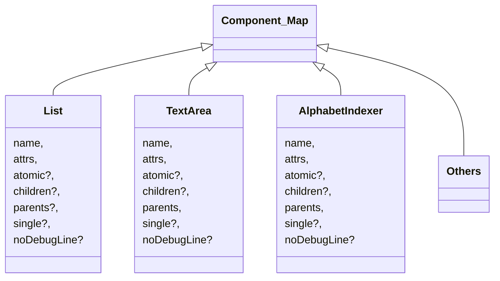

## 新增或修改组件规则

#### 概述：

当新增或更新组件和属性时，需要在compiler/src/components目录下新增或修改对应的json文件。

同时我们将公共属性放入compiler/components/common_attrs.json文件中，若要更新公共属性在该文件下修改即可。

组件形式如下:

```gn
{
  "name": string,
  "attrs": [],
  "atomic": boolean,
  "parents": [],
  "children": [],
  "single": boolean,
  "noDebugLine": boolean
}
```

| 参数                                             | 参数描述                            |
| ------------------------------------------------ | ----------------------------------- |
| name(必须)                                       | 组件名称                            |
| attrs(组件必须, 若没有私有属性对应value写空数组) | 组件属性                            |
| atomic(可选，默认false)                          | 是否不能有子组件                    |
| parents(可选，默认所有组件可用)                  | 父组件只能是哪些组件                |
| children(可选，默认所有组件可用)                 | 子组件只能是哪些组件                |
| single(可选，默认false)                          | 是否只能包含一个子组件              |
| noDebugLine(可选，默认false)                     | 预览模式下对应组件是否生成debugline |

#### 模块结构：



#### 文件结构：

```bash
ace_ets2bundle/compiler
	├── src
   		├── component_map
	├── components
   		├── Option
   		├── Line
		├── Gauge
   		....
```
